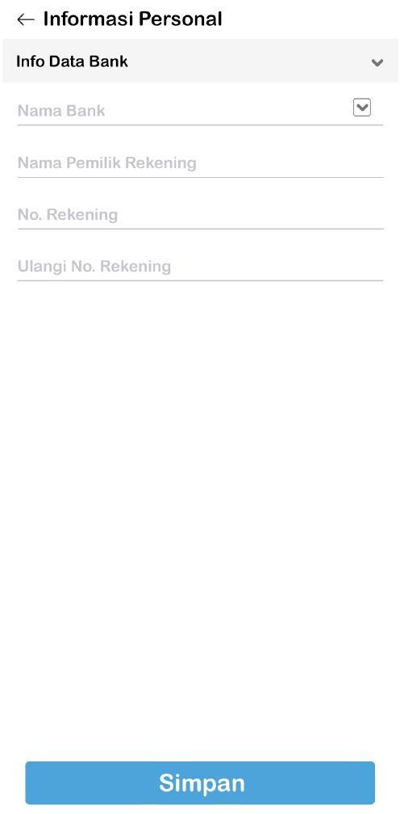
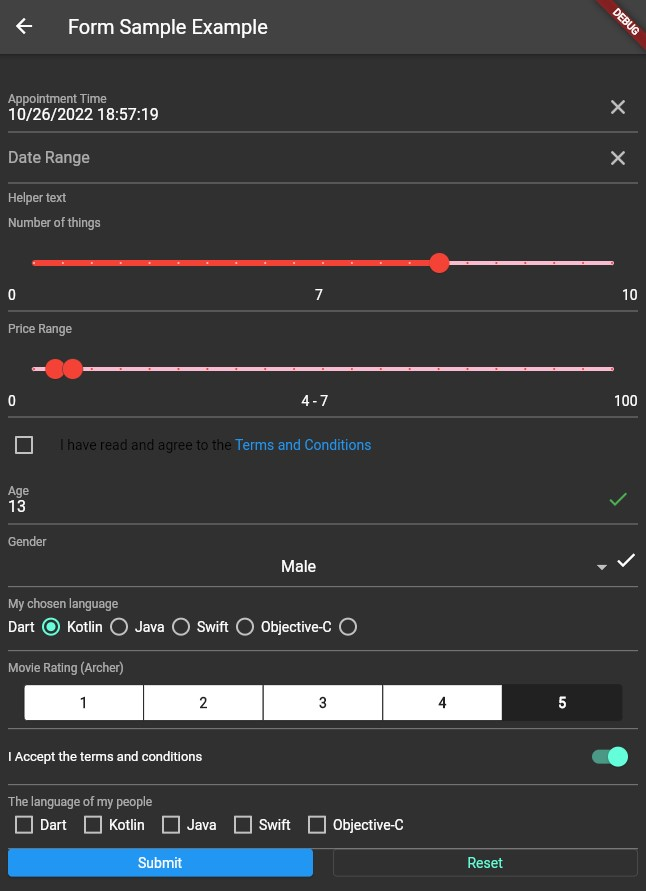

# quickstart_form

<h4 align="center">Sample Form &nbsp&nbsp&nbsp&nbsp&nbsp&nbsp&nbsp&nbsp&nbsp&nbsp&nbsp | &nbsp&nbsp&nbsp&nbsp Home Screen &nbsp&nbsp&nbsp&nbsp | &nbsp&nbsp&nbsp&nbsp Side Drawer</h4>

A quickstart Flutter project, especially for Forms.
It is mandatory to use GetX, VelocityX, DotEnv & FormBuilder to make your life younger.

You might want to integrate with following quickstart:
- Approval : When forms of onboarding with ID Card included, the photo will be uploaded into server, and server might need to approve manually. 

## Getting Started

This project is a starting point for a Flutter application.

A few resources to get you started if this is your first Flutter project:

- [Lab: Write your first Flutter app](https://flutter.dev/docs/get-started/codelab)
- [Cookbook: Useful Flutter samples](https://flutter.dev/docs/cookbook)

For help getting started with Flutter, view our
[online documentation](https://flutter.dev/docs), which offers tutorials,
samples, guidance on mobile development, and a full API reference.
